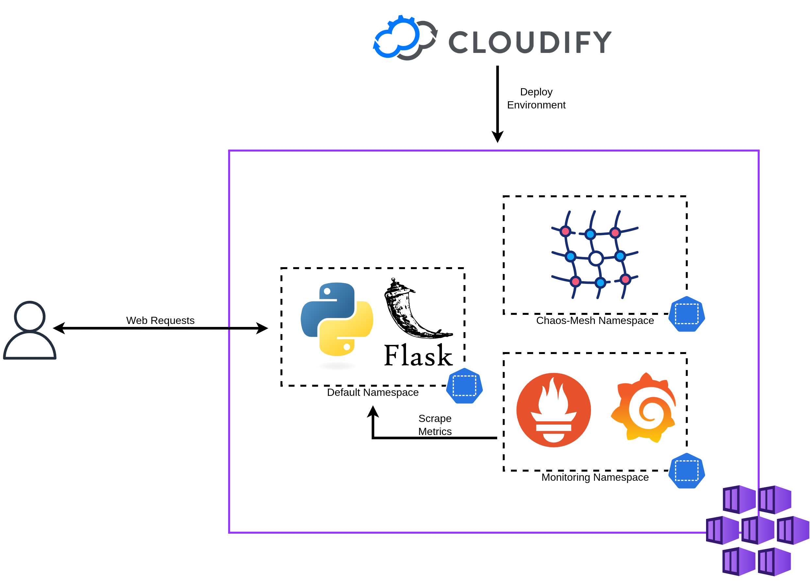

# Chaos Mesh Day 2 Operations

This repository contains blueprints to deploy Chaos Mesh, the Prometheus Operator, and a simple Python web application using Cloudify.

It is a companion repository for a blog article on the [Cloudify Blog](https://cloudify.co/blog).
